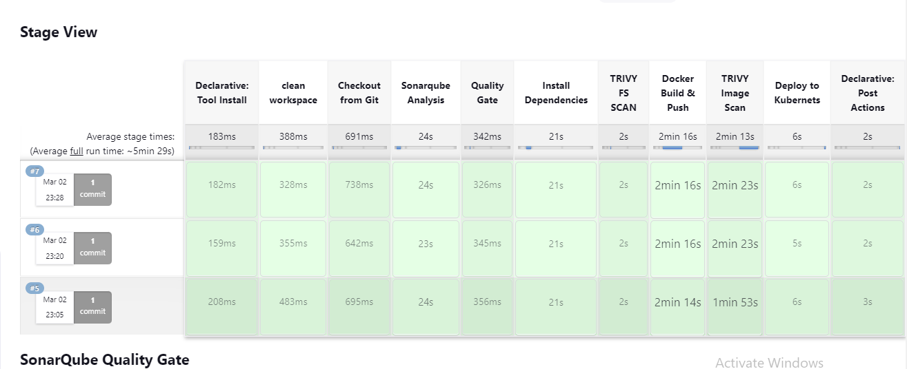

# Youtube Clone application Deployment, Static Code Testing, Monitoring, Notification Service.
**Tools Used**

- **Git**: Version control system for managing and tracking changes to code. Used for Code Commit.
- **Github**: Web-based platform for hosting code repositories and collaboration. Used as a Code Repository.
- **Terraform**: Infrastructure as Code (IaaC) tool for provisioning and managing cloud resources.
- **Docker**: Platform for developing, shipping, and running applications in containers, ensuring consistency across environments. Utilized for Containerization.
- **SonarQube**: Static code analysis tool used for continuous inspection of code quality, identifying bugs, vulnerabilities, and code smells. Used for Static Code Testing.
- **Jenkins**: Automation server for continuous integration, delivery, and deployment pipelines. Facilitates the automation of software development processes.
- **EKS**: Amazon Elastic Kubernetes Service (EKS), a managed Kubernetes service for container orchestration on AWS (Amazon Web Services) cloud platform.
- **Prometheus**: Monitoring and alerting toolkit for collecting and querying metrics, storing them in a time-series database, and visualizing data. Used for Logs Check.
- **Grafana**: Open-source analytics and monitoring solution for visualization and analysis of metrics and logs. Provides customizable dashboards and data querying.
- **Trivy**: Vulnerability scanner for containers, focusing on providing fast and accurate detection of vulnerabilities in Docker images. Used for Docker Image Scan.

## Architecture

<p align="center">
  
  </p>


# [A] Let's use Terraform to create an EC2 instance for Jenkins, Docker and SonarQube
**Resource Deployment**
1. Use Terraform to Launch EC2 Instance and service installation, Security Groups.
2. Dir[Jenkins-SonarQube] contains Terraform manifest files update accordingly.
```terraform
terraform init
terraform validate
terraform plan
terraform apply --auto-approve
terraform destory
```

### Jenkins Configuration

**Install Jenkins plugins**
Eclipse Temurin installer, SonarQube Scanner, Sonar Quality Gates, Quality Gates, NodeJS, Docker, Docker Commons, Docker pipeline, Docker API, Docker Build steps, prometheus metrics, Kubernetes, Kubernetes Client API, Kubernetes Credentials, Kubernetes CLI.


**Jenkins Global Credentials:**

ID: SonarQube-Token (Used secret text method)

ID: dockerhub (Use Username password method OR Secret text)

ID: gmail (Username password method)(Login gmail and find app password. Add app name youtube-clone, create and note the password and add in jenkins credentials.) [udgs zvas owrt yadn]

ID: kubernetes ==> Type: add file == secret.txt
(Copy Kubernetes Config file data and save it in secret.txt and use it as credentials)


**Manage Jenkins**

Manage Jenkins Tools: NodeJS installation => name: node16 ==> Install Automatically: Version 16.2.0
	
JDK installation ==> name: jdk17 ==> install automatically: Version 17...
	
Docker Installation ==> name: docker ==> version: latest
	
Sonar Scanner installation ==> name: sonar-scanner ==> verson 5.0.1


**Configure Email Notification Through Jenkins**
Gmail Must have Two Factor Authentication Enabled. Go to App Passwords and Create App password and use in Email service configuration.

In manage Jenkins ==> System ==>  Email Notification ==> SMTP Server ==> name: smtp.gmail.com ==> Default user  email sufix: your email address ==> User SMTP authentication: Username and password (email & GeneratedPassword) SMTP port: 465 ==> Test email configuration 

Extended Email Notification ==> Server: smtp.gmail.com ==> Port: 465 ==> Advanced ==> credentials ==> Add gmail cred ==> Use SLL ==> Default content type: HTML ==> choose triggers


## Configure SonarQube and Integrate with Jenkins
**SonarQube Token Creation**

Sonar Qube Configuration: Initial ID password is admin. Then Create Authentication Token. name: token-for-jenkins. Copy 
the token and add in jenkins global credentials.

[squ_afb7ed83143c5363we4134d4sd521f5909db586e]


Manage Jenkins ==> System ==> SonarQube Installation ==> name: SonarQube-Server ==> ServerURL: SonarQube Servers(http://PrivateIP:9000) ==> token: SonarQube-Token


SonarQube ==> Quality Gate ==> Create ==> SonarQube-Quality-Gate


SonarQube ==> Administration ==> General Settings Webhooks ==> Create Webhook ==> name: jenkins ==> URL: jenkins(http://PrivateIP:8080)/sonarqube-webhook/

http://172.31.58.127:8080/sonarqube-webhook/


SonarQube ==> Create a Project ==> Project display name: Youtube-CICD ==> project key: Youtube-CICD ==> Setup.

SonarQube ==> Locally ==> Provide Token ==> Token name: Analyze "Youtube-CICD" ==> Generate. ==> Continue ==> Other ==> Linux. (Copy the code)

sqp_35ad432d364184382a8914b1aeb82cddeffcabf3


sonar-scanner \
  -Dsonar.projectKey=Youtube-CICD \
  -Dsonar.sources=. \
  -Dsonar.host.url=http://34.229.137.158:9000 \
  -Dsonar.login=sqp_35ad432d364184382a8914b1aeb82cddeffcabf3


**Create and Run Jenkins Job till 'TRIVY FS SCAN'**


**Add Docker Push Image phase in Jenkins Pipeline and Trivy Phase**


# [B] Terraform to Create EC2 Instance and Setup Prometheus & Grafana
1. Use Terraform to Launch EC2 Instance and service installation, Security Groups.
2. Dir[Prometheus-Grafana] contains Terraform manifest files update accordingly.

**Commands to check Installed services**
```bash
sudo systemctl status prometheus
sudo systemctl status node_exporter
sudo systemctl status grafana-server
```

**Add job for node exporter in prometheus**
```bash
sudo nano /etc/prometheus/prometheus.yml 
```
and below the job of prometheus, add job for node exporter
```
  - job_name: 'node_exporter'
    static_configs:
      - targets: ['Monitoring server Public IP:9100']

```
Check the indentatio of the prometheus config file with below command
```bash
promtool check config /etc/prometheus/prometheus.yml
```
Reload the Prometheus configuration
```bash
curl -X POST http://localhost:9090/-/reload
```


Login into Grafana and add Prometheus.(node Exporter) 

Connection ==> Data Soruce ==> Prometheus and add http://grafana-publicIP:9090 then save and test.

Import Dashboard ==> 1860 and Load.

Manage Jenkins: Prometheus and add build parameter, add build status.


**On monitoring server add job for Jenkins**
```bash
sudo nano /etc/prometheus/prometheus.yml
```
```
  - job_name: 'jenkins'
    metrics_path: '/prometheus'
    static_configs:
      - targets: ['Jenkins Public IP:8080']
```
Check the indentatio of the prometheus config file with below command
```bash
promtool check config /etc/prometheus/prometheus.yml
```
Reload the Prometheus configuration
```bash
curl -X POST http://localhost:9090/-/reload
```

**Jenkins Job Dashboard**

Import Dashboard ==> 9964 and Load, select source and import.

This will Give Jenkins Server Data Like Resources Usage, Speed, Passed and failed Jobs count, many more.


## [C] Create AWS EKS Cluster
1. Install kubectl on Jenkins Server
```bash
sudo apt update
sudo apt install curl
curl -LO https://dl.k8s.io/release/$(curl -L -s https://dl.k8s.io/release/stable.txt)/bin/linux/amd64/kubectl
sudo install -o root -g root -m 0755 kubectl /usr/local/bin/kubectl
kubectl version --client
```
2. Install AWS Cli
```bash
curl "https://awscli.amazonaws.com/awscli-exe-linux-x86_64.zip" -o "awscliv2.zip"
sudo apt install unzip
unzip awscliv2.zip
sudo ./aws/install
aws --version
```
3. Installing eksctl
```bash
curl --silent --location "https://github.com/weaveworks/eksctl/releases/latest/download/eksctl_$(uname -s)_amd64.tar.gz" | tar xz -C /tmp
cd /tmp
sudo mv /tmp/eksctl /bin
eksctl version
```
4. Setup Kubernetes using eksctl
```bash
eksctl create cluster --name Virtualtechbox-cluster \
--region us-east-1 \
--node-type t2.small \
--nodes 3 \
--zones=us-east-1a,us-east-1b \
--node-zones=us-east-1a,us-east-1b \
```
5. Verify Cluster with below command
```bash
kubectl get nodes
```


## [D] Integrate Prometheus with EKS and Import Grafana Monitoring Dashboard for Kubernetes
1. Install Helm
```bash
sudo snap install helm --classic
helm version
```
                   OR
```bash
curl -fsSL -o get_helm.sh https://raw.githubusercontent.com/helm/helm/master/scripts/get-helm-3
chmod 700 get_helm.sh
./get_helm.sh
helm version
```

2. Install Prometheus on EKS
```bash
helm repo add stable https://charts.helm.sh/stable          ///We need to add the Helm Stable Charts for our local client

helm repo add prometheus-community https://prometheus-community.github.io/helm-charts     ///Add Prometheus Helm repo

kubectl create namespace prometheus            ///Create Prometheus namespace

helm install stable prometheus-community/kube-prometheus-stack -n prometheus      ///Install Prometheus

kubectl get pods -n prometheus          ///To check whether Prometheus is installed

kubectl get svc -n prometheus           ///to check the services file (svc) of the Prometheus
```

##let’s expose Prometheus to the external world using LoadBalancer
```bash
kubectl edit svc stable-kube-prometheus-sta-prometheus -n prometheus    ///type:LoadBalancer, change port & targetport to 9090, save and close

kubectl get svc -n prometheus    //copy dns name of LB and browse with 9090
```

Go to Grafana and Add Data Source.

Name: Prometheus-EKS ==> URL: http://DNS-of-LB:9090 ==> save.

Import Dashboard ==> 15760 ==> DATA Source prometheus: Prometheus-EKS

Import Dashboard ==> 17119 ==> DATA Source prometheus: Prometheus-EKS


## [E] Configure the Jenkins Pipeline to Deploy

After setting up kubernetes Credentials Add Kubernetes Deployment Stage in Jenkins Pipeline update as required and Run the job.


## [F] Set the Trigger and Verify the CI/CD Pipeline
```bash
git config --global user.name "your-name"
git config --global user.email "your-email-address"
git clone https://github.com/loki2111/Youtube-clone.git
cd Youtube-clone
git add .
git commit -m "test change"
git push origin main
```


**Update Jenkins Job**

Github Project (On) ==> Add github URL ==> Build Triggers: Github hook trigger for GitScm Pooling

**Add Webhook in Github**

Settings ==> Webhooks ==> payload URL: http://Jenkins-IP:8080/github-webhook/
Save.


**Now Whenever a push in made in main branch jenkinspipeline will be triggered**

## Pipeline Stages

<p align="center">
  
  </p>